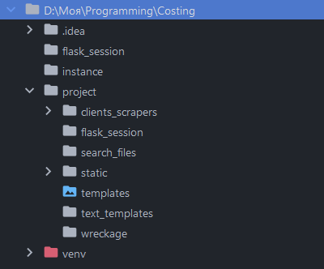

# COSTING
#### Video Demo:  <URL HERE>
#### Description:
COSTING is a platform to spy on your competitors and keep track of their prices on the same commodities that you sell.
First the user goes through the authentication process. The routes responsible for the authentication are located in 
the auth.py file. There you are able to sign up, log in, and log out.

## Story of origin

One day, I landed an internship at a dental equipment company and dove headfirst into the world of 
competitive analysis. They laid out the workflow for me on day one, including the task of scouring 
competitors' websites to ensure our prices were always the best in the market. Little did I know, 
I would be manually keeping tabs on prices and making strategic moves to stay ahead of the game. 
It was a challenging but valuable experience that I knew would benefit the dental equipment sales team. 
The manual labor involved in this task eventually inspired me to create a project that would automate 
and streamline the process, making life easier for myself and others in the company.


## Project Design

Pic of a project design (to be inserted later)

## Project Structure 




### flask_session/

Contains users' sessions.

### instance/

Contains the database

To create all the tables in the database provided by the **project/module.py**, run the following command in your terminal:

```
python

from project import create_app, db 
                               
app = create_app()
with app.app_context():
   db.create_all()
```

The database file **db.sqlite3** contains 7 necessary tables:
1. users: 
   - *This model is used to store basic user information such as 
   company name, company INN, login, email, and password. It has been decided to identify users
   by their company inn as it's a unique identification number and cannot be repeated twice in the db.*
 
2. companies_info:
   - *This model stores information about companies, including their INN, website, organization, OGRN, 
   registration date, sphere, address, number of workers, CEO, and information loading date.*

   - *However, this info is gotten from another web source <https://checko.ru/>. 
   Costing uses a scraper to get the info by the company inn
   provided by the user. The code for the scraper in written in **project/search_files/search_company.py**.*

   - *The information is used to display on the main user page as he logs in and gets updated every 3 days*

3. competitors: 
   - *This model stores information about a user's competitors, including their connection statuses 
   (disconnected, connected, requested), competitor INN as a unique identifier, nickname, and website.*

4. scrapers: 
   - *This model stores paths to the companies' website scrapers to 
   avoid writing the same web scraper multiple times for each company and helping follow the DRY principle. 
   It also helps **project/search_files/async_search.py** find the needed scraper faster with less overload for the server
   when the db gets moved to a different one.*
 
5. usersitems: 
   - *This model stores unique connections between users and their items they want to keep track of.
   It could be their own items, or items from their competitors website (of course the competitors website needs
   to be connected aka the scraper has to be written and the competitor status needs to be changed to "connected"* 
   - *A user gets connected to an item via the item's link on the competitors website and the user's id*
   
 
6. itemsrecords: 
   - *This model stores all the records of items' prices, including the item name, company INN the item belongs to,
   price, date of the record, and link from the company's website.* 
 
7. itemsconnections: 
   - This model stores connections between items even when an item is deleted
   to support future features or item restoration by the user. When the connection has been added, one item's link
   gets associated with the other and the user can compare their prices

 

### project/

The main module that contains the working part of the app. There are 2 stages: authentication and main functionality


#### ./clients_scrapers/

This folder contains scrapers for competitors' websites. When a user registers, a folder is created with their inn as 
the name to avoid repetitions. The purpose of the folder is to store new scrapers for the user's competitors' 
websites if it hasn't been created yet. Additionally, if a user wants to connect their own website to the 
platform, a scraper template is created for their inn.  
 
When a user requests a competitor's connection, an email with all the necessary information is sent to the responsible admin (in this case, always me). The files responsible for writing a scraper template are as follows: 
1. text_templates/class_template.txt - a text version of a class to write a new scraper 
2. systems.py - stores classes containing the logic of creating, writing, and deleting scrapers 
3. server.py - main file with all the routes and manages server responses to user actions 
4. text_templates/request_connect_template.txt - a template of a request email 
5. emails.py - fills in the gaps in the request email text and sends it to the responsible admin 
6. credentials.py - stores credentials to the corporate email address (an env file was not created as the data needed to be accessed and changed across multiple devices over time. This data is not highly sensitive). 
 
If a user wants to delete a scraper, it will only be deleted if it has never been changed, as other users may also 
be using it. A competitor will only be connected to a user when the admin finishes implementing the scraper and 
changes the status of the competitor to "connected". This methodology could be improved by creating an admin panel 
and implementing version control.


#### ./search_files/

The platform allows users to simultaneously search for desired items on multiple websites. This feature 
leverages a module that connects all the competitor scrapers linked to the user's account, enabling 
asynchronous processing. Utilizing libraries such as *asyncio* and *aiohttp*optimizes the search 
process by efficiently managing time.  
 
The server initiates requests to competitors' websites and, while waiting for responses, seamlessly 
switches to the next website to avoid unnecessary delays. The key components of the system include: 
- async_search.py: the main search functionality 
- get_classes.py: contains functions to identify and import the appropriate scraper class into async_search.py 
- search_company: includes a Company class that retrieves information about a company based on 
its identification number (INN). The returned dictionary includes details such as INN, website, organization, OGRN, registration date, sphere of operation, address, number of employees, and CEO information.

### ./static/ 
The folder is used to store all images, JavaScript files, and other necessary resources to enhance 
the user experience. Each JavaScript file is associated with a specific page it functions on. 
For instance, homepage.js corresponds to the "/" route, while profile.js is linked to the "/profile" 
route, and so forth. 
 
The primary function of JavaScript files is to facilitate communication with the server through AJAX 
requests as needed and update user information. For example, homepage.js enables users to modify their 
website information if it is not yet linked or change the email address for reports. However, attempting 
to alter a connected website will be blocked by the server. All constraints and validation rules are 
implemented in conjunction with the frontend components to ensure consistency and data integrity.

### ./templates
The system stores all Jinja HTML templates utilized by the main routes to present information to users. Specifically, the 
route "/price-looker" comprises three templates: 
- "./price-looker.html": Displays competitors' prices for the same item when accessed from the header. 
- "./price-looker-results.html": Embedded within "./price-looker_layout.html" to provide users with updated results, 
sent as a response to an AJAX request.  
- The AJAX request is initiated by "price_looker.js" to fetch the new results and render them using the Jinja template.

### ./text_templates
The contents are:
- class_template.txt - used to write unfinished scrapers to a new file when website connection gets requested
- request_connect_template.txt - is a template for a message that gets sent to Admin when a request connection gets sent


### Main block

In the project, there are two main files: 
 
1. **auth.py**: This file is responsible for managing the user authentication process. It contains the following routes: 
   - "/signup": Allows users to sign up for the platform 
   - "/login": Enables users to log in to their accounts 
   - "/logout": Logs the user out of the platform 
   - "/checklogin/<cur_login>": Verifies if a login is already in use 
   - "/checkinn/<cur_inn>": Checks if a company is already registered and provides feedback to the frontend 
 
2. **server.py**: This file houses the primary functional routes, accessible only to logged-in users. The implemented 
routes include: 
   - "/": Homepage displaying basic user information from the companies_info table. Automatic updates occur if user 
   data has not been refreshed in over 3 days. 
   - "/profile": Displays service information such as the number of competitors, types of items sold, and items 
   connected from competitors' websites. Users can manage connections and manually add items. 
   - "/profile/load_item": Adds items from the user's or a competitor's website to the item list and updates prices. 
   - "/company-goods": Shows the list of all added goods by the user. 
   - "/company-goods/refresh_all": Retrieves up-to-date prices for all added items, excluding manually added ones. 
   - "/company-goods/delete-item": Allows users to delete selected items. 
   - "/competitor-monitoring": Manages competitors, adds new ones, and establishes connections with the user's profile. 
   - "/comparison": Compares prices for all connected items, highlighting discrepancies in prices. 
   - "/price-looker": Manually searches for items on chosen competitors' websites. Offers potential for optimization 
   in implementation. 
   - "/profile/delete_competitor/<com_inn>": Deletes a competitor from the list, with the scraper removed if not 
   used by other users or changed in any way from the template. 
   - "/request_connection/<cp_inn>": Requests connection with a competitor and notifies the responsible admin via email. 
   - "/profile/change_web": Allows users to change their website if not previously connected. 
   - "/profile/change_email": Enables users to update their email address. 
   - "/profile/link_items": Connects two links for easy price comparison in "/comparison". 
   - "/items_owned": Displays a list of items owned by the user from their website. 
   - "/autoload_associations": Analyzes user-owned items and searches for similar items on competitors' websites 
   based on various parameters. This is the part of the project that has some room for further enhancement and development.
   


### Assistance
Additional files in the project support the functionalities of server.py and auth.py: 
1. **systems.py**: Manages file creation and deletion processes. 
2. **managers.py**: Validates and ensures the suitability of information. Includes: 
   - *LoginManager*: Validates that all requirements are met. 
   - *PasswordManager*: Ensures password compliance and security. 
3. **helpers.py**: Contains additional functions and classes for various tasks such as working with dates, 
handling situations where regular requests to competitor websites are blocked, and other utility functions.


# Notes to myself (workflow tasks)
IT's a place where i keep my notes and ideas to upgrade this project. There is always time for a little improvement

Last possible features:

Necessary 
- make it so that on the profile there was the correct number of goods, competitors (DONE)
- add connection though the price looker (DONE)
- - chosen user's item input field (DONE)
- - if the item is chosen, add an item and add connection to the item (DONE)
- - if the item is empty, the item just gets added to the tracked item's list (DONE)
- show names of the items in the profile, Not links (DONE)
- autoload associations (takes every user's item and looks for it on every competitor's site getting  items with a
set similarity wiggle room) Need to get the needed similarity from the Competitors and items file (DONE)
- filters by the color of the price on the comparison page (DONE)
- refine the code
- refine the view of the pages
- clear the db and test

Preferred
- add connection to existing items using a dropdown or input autocomplete field in tracked goods
- filters by competitor
- load items (using an Excel spreadsheet with 3 columns (name, price, link)) and add a button to get a template excel


Make profile and web links vital to work with


Profile (DONE)
 - html for request to connect your site to return
   - displays: input link to request connection to the clients website
   - displays: request connection button
   - or add items manually
   -


Search page:
- need parsers for an item's page and a search page of the main competitors of stomart (done)
- work out how to give the user only HIS parsers
It could be implementer like this:
- as the person registers, a folder with his loging as a name is created
- when the client adds a competitor a file with a competitors inn as a name is created and
- it adds the path to the parser to a table (cl
- ient_scrapers(col (number, inn, path)))
- NEED TO ADD A COLUMN TO THE COMPETITORS TABLE(STATUS(CONNECTED\NOT CONNECTED(OR TRUE\FALSE)))
- search looks for all the scrapers of the connected competitors by their inn, finds their paths and imports the classes
into a file "search all" where the search happens asynchronously through all the websites
- if the scraper is already somewhere. it connects when the admin changes the status of the connection
from "disconnected" to "connected". When it's connected the paths for all the connected ones is gotten 
from the Model Scrapers


to do:
- create a button "request prices connection" next to a competitor

initial tasks for the profile page:
- save the data in a new table "companies" with the corresponding keys. Foreign key is inn!
- - create a model (Done)
- - remake all the instances (Done)
- - create a function to save the data (Done)
- if the data in the table hasn't been refreshed for a set period of time or if there are no data, reload them. (Done)
- if the field in HIS profile is empty, let the user add the info oneself or change it.
- If he wants to add the info about his competitors, he can change only fields with NONE in it
- you need a simple profile to see that the info about the logged user is correctly shown (Done)
- load up additional info about the user using a web scraper (Done)


THE BEGINNING OF THE MAIN PART

ENOUGH FOR THE AUTHENTICATION PART 
to do:
- finish up the registration pages front end (Done)
- js script to check the password as the user types it and say if it is valid and visualize it (Done)
- ajax script to check if the current login and inn is available (Done)

login requirements: (Done)
- len >= 3
- unique

to do:
- login checker function (returns false if the login satisfies the requirements else return login) (Done)
- email validation funk (Done)


password requirements: (Done)
- len >=6
- has uppercase letters 
- has alpha
- no spaces
- has digits 
- has lowercase letters

to do (Done):
- password checker function (Done)

I did not start writing this from the very beginning!

useful links
https://www.digitalocean.com/community/tutorials/how-to-add-authentication-to-your-app-with-flask-login
source to get the select with filter https://www.youtube.com/watch?v=qNO37iMzmFY